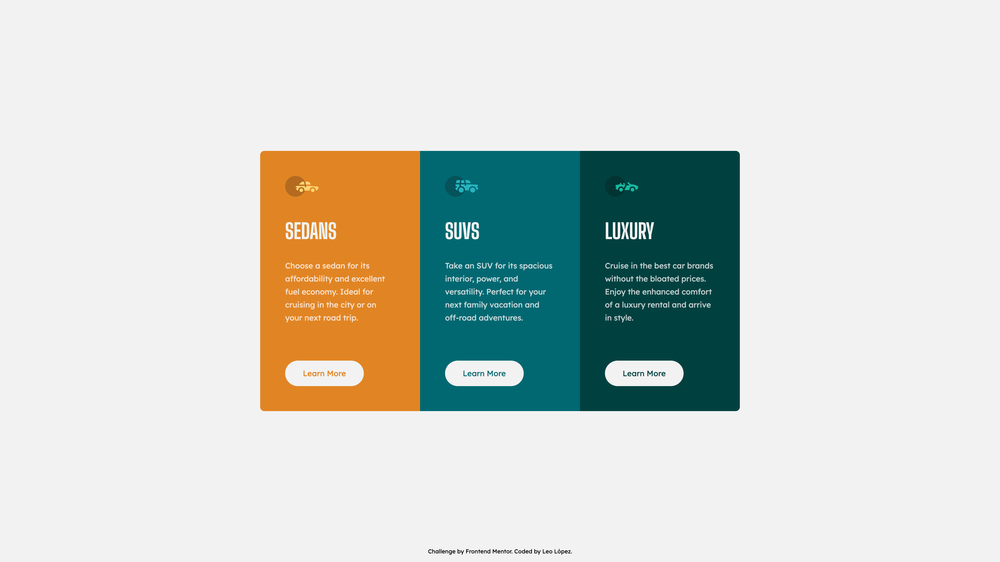

# Frontend Mentor SPA Template with React

This template is to start a new challenge of [Frontend Mentor](https://www.frontendmentor.io/) only.

Replace this tags:

- `CHALLENGE_NAME`: Challenge name.
- `CHALLENGE_URL_SLUG`: Challenge URL Slug.
- `CHALLENGE_SOLUTION_URL_SLUG`: Solution URL Slug.
- `REPO_NAME`: Repository name of this challenge.
- Update slug and title in Table of contents.
- Add a `preview.jpg` image file under root dir.
- Replace `REPO_NAME` with repository url slug in `vite.config.ts`.

> Note: Remove this heading section.

# Frontend Mentor - CHALLENGE_NAME

This is a solution to [CHALLENGE_NAME](https://www.frontendmentor.io/challenges/CHALLENGE_URL_SLUG) challenge of Frontend Mentor.

Frontend Mentor challenges help you improve your coding skills by building realistic projects.

## Table of contents

- [Frontend Mentor Simple Template](#frontend-mentor-simple-template) <-- Remove this line
- [Frontend Mentor - CHALLENGE_NAME](#frontend-mentor---challenge_name)
  - [Table of contents](#table-of-contents)
  - [Overview](#overview)
    - [Screenshot](#screenshot)
    - [Links](#links)
    - [Built with](#built-with)
  - [Author](#author)

## Overview

### Screenshot

### Links

- Solution URL: [https://www.frontendmentor.io/solutions/CHALLENGE_SOLUTION_URL_SLUG](https://www.frontendmentor.io/solutions/CHALLENGE_SOLUTION_URL_SLUG)
- Live Site URL: [https://ciensprog.github.io/REPO_NAME/](https://ciensprog.github.io/REPO_NAME/)

### Built with

- Semantic HTML5 markup
- [Tailwindcss](https://tailwindcss.com) - Utility-first CSS Framework
- [React](https://reactjs.org/) - JS library
- [Vite](https://vitejs.dev) - Frontend Tooling

## Author

- Frontend Mentor - [@Ciensprog](https://www.frontendmentor.io/profile/Ciensprog)
- Twitter - [@Ciensprog](https://www.twitter.com/Ciensprog)
